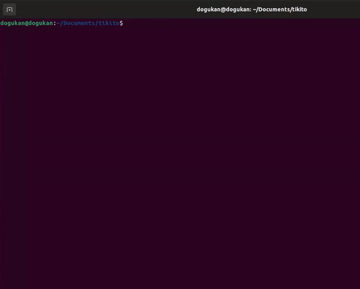

# tikito



### Description
tikito is a Tic Tac Toe game playing against an AI. The AI player is implemented using Minimax algorithm. The rules are no different than the normal Tic Tac Toe game. The game comes with colors only if you are using a Unix system since the program uses Unix color codes. 

### Compile & Run
```
    git clone https://github.com/dogukanteber/tikito.git
    cd tikito
    gcc main.c -o main && ./main
```

### Dependencies
The program is currently tested on Ubuntu OS. There should not be any problem running this game on any Unix system. However, trying to run the program on Windows may result to an error since as stated above, it uses Unix color codes.

### Licence
Released under the revised  GNU GENERAL PUBLIC LICENSE. See [LICENSE](LICENSE) for details.
